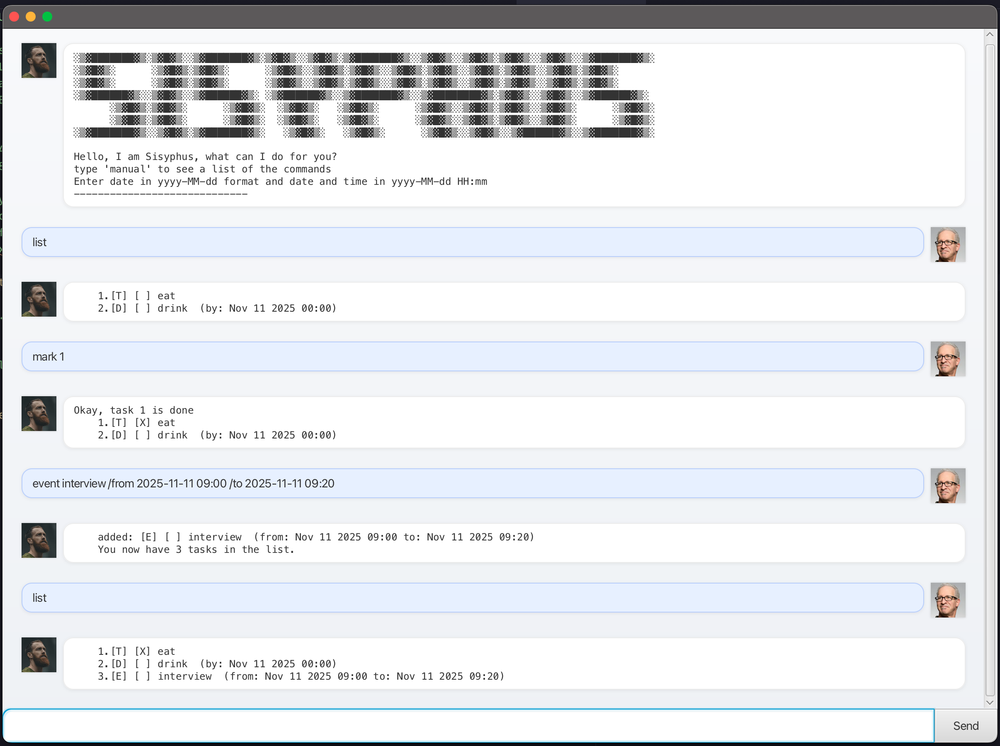

# Sisyphus User Guide

## What is Sisyphus?
>The gods forced him to roll an immense boulder up a hill only for it to roll back down every time it neared the top, repeating this action for eternity.
- It is a command based task manager, a supercharged todo list.
- It is not a calendar.

## Help
type `manual` to see a list of tasks

## Features
1. Simple todo
2. Todo by a deadline using `deadline <task> /by <date(time)>`
3. Event using `event <task> /from <date(time)> /to <date(time)>`
4. Display all the tasks using `list`
5. Display the tasks by earliest first using `latest`
6. Autosave and exit by using `bye`
7. Reload saved tasks if saved